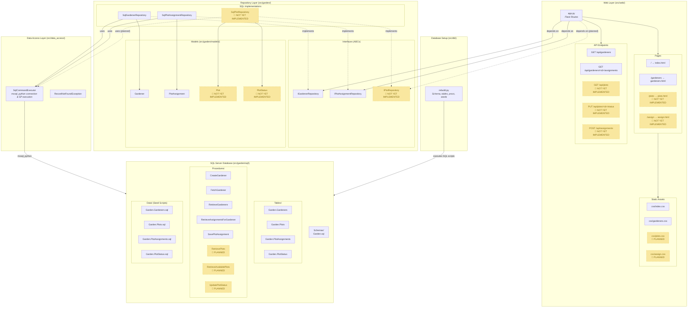

# MS SQL Server Python Project Template
This project comes with a two-part development container:
- A Microsoft SQL Server Express server. This comes setup with two databases. [WideWorldImporters](https://github.com/Microsoft/sql-server-samples/tree/master/samples/databases/wide-world-importers) and **CC520**, which is a blank database. How to use these is outlined below.
- A Ubuntu server, which is where you may write your SQL files and python web app using Flask.

**Note:** This dev container can take anywhere between 3-5 minutes to setup from scratch. Once the servers are created, VS Code will install extensions. Once the MSSQL extension is installed (you will see a server icon show up on the left hand side), you can continue to the next section.

## Connecting to the Database.

Open the MSSQL extension (server icon on the left). If it is your first time opening it, it will do some initial configurations. Three databases are included as part of this setup:
1. **CC520**:  `USE CC520;`. This database is where the Garden schema is stored for this example project
2. **wide-world-importers**: Included in case you want to experiment with a larger database. 
3. **ms-sql-server-admin**: This database is purely for the management of the MS SQL Server instance for this development environment. You should not have to use this for anything in this class, but it is here if you would like to explore.


  **Example database connection information:** 
  - **Profile Name**: `Any Name` (if specifying the database, see option below, it is helpful to name it after the database you are connecting to)
  - **Input Type**: `Parameters`
  - **Server Name**: `localhost`
  - **Trust server certificate**: Check this box
  - **Authentication type**: `SQL Login`
  - **User name**: `cc520-admin`
  - **Password**: `database3ssentials!`
    - NOTE: If the cc520-admin user should give you access to both databases listed above...but if you need higher admin access, use the credentials below:
      - **User name**: `SA`
      - **Password**: `sup3rs3cur3P@ssword`
  - **Save password**: Check this box 
  - **Database name**: This is optional. If you do not specify a database name, when you run a query, you will need to specify the database then (`USE databasename`). If you do specify the database name here, then you will need to add a new connection for each database you need to use.

## Project Layout

```
├── src/                        # Application source code
│   ├── __main__.py             # Entry point
│   ├── data_access/            # Generic database utilities
│   │   ├── sql_command_executor.py   # Executes raw SQL commands via mssql_python
│   │   └── RecordNotFoundException.py # Custom exception used when processing queries
│   ├── db/                     # Database setup and migration
│   │   └── rebuild.py          # Rebuilds schema, tables, procedures, and seed data
│   ├── garden/                 # Garden domain (repository pattern)
│   │   ├── i_gardener_repository.py          # Gardener repository interface (ABC)
│   │   ├── i_plot_assignment_repository.py   # Plot assignment repository interface (ABC)
│   │   ├── sql_gardener_repository.py        # SQL Server gardener repository
│   │   ├── sql_plot_assignment_repository.py # SQL Server plot assignment repository
│   │   ├── models/             # Domain models (Gardener, PlotAssignment)
│   │   └── sql/                # SQL scripts used by the rebuild process
│   │       ├── Data/           # Seed data (MERGE-based upserts)
│   │       ├── Procedures/     # Stored procedures
│   │       ├── Schemas/        # Schema creation (Garden)
│   │       └── Tables/         # Table definitions
│   └── web/                    # Flask web application
│       ├── app.py              # Routes and API endpoints
│       ├── static/             # CSS stylesheets
│       └── templates/          # Jinja2 HTML templates
├── test/                       # Test suite (pytest)
│   ├── common_helpers.py       # Shared test utilities
│   ├── test_web_app.py         # Web/API route tests
│   ├── data_access/            # Tests for sql_command_executor
│   ├── db/                     # Tests for database rebuild
│   └── garden/                 # Tests for gardener and plot assignment repositories
├── scripts/                    # Utility scripts (e.g., PyDoc generation)
├── docs/                       # Generated documentation
├── conftest.py                 # Pytest configuration and fixtures
├── pyproject.toml              # Poetry project config and dependencies
```

### Architecture Diagram

The below diagram can be viewed in VS Code via the mermaid plugin, on the Github repo page, or you can open the project-diagram.svg (located in this project's root folder) in your local web browser.


## Using the Python example

This project uses Poetry for dependency management. This should happen automatically for you when running this in a dev container.

If Poetry is not installed yet, install it first:

```bash
pip install poetry
```

You can also use the official installer if you prefer:

```bash
python -m pip install --upgrade pip
python -m pip install poetry
```

Install dependencies from the project root with:

```bash
poetry install
```

## Managing dependencies with Poetry

Add a new runtime dependency:

```bash
poetry add package-name
```

Add a new development dependency:

```bash
poetry add --group dev package-name
```

Update all dependencies to the newest versions allowed by `pyproject.toml`:

```bash
poetry update
```

Update a single dependency:

```bash
poetry update package-name
```

If you change dependency constraints manually in `pyproject.toml`, refresh the lock file with:

```bash
poetry lock
```

After dependency changes, reinstall or sync the environment with:

```bash
poetry install
```

Though you might need to select an interpreter for VS Code if this is your first time running it. To select the interpreter, press `CTRL + SHIFT + P` or `F1` to open the command pallet (shows up at the top of VS Code), then search for and click on `Python: Select Interpreter`. If you are using Poetry's in-project virtual environment, select `.venv`.

Then create a `.env` file in the project root to store your database connection information. An example is included down below in step 1.


## Getting Started with the Flask Application

Follow these steps to set up and run the Flask application.

### 1. Create a `.env` file

Create a `.env` file in the project root with your database connection information:

```
DB_SERVER=localhost
DB_DATABASE=cc520
DB_USER=cc520-admin
DB_PASSWORD=database3ssentials!
```

### 2. Rebuild the database (first time, then as needed)

The project includes a cross-platform Python runner to set up your database schema, tables, and stored procedures:

```bash
# full schema + tables + procedures + seed data
poetry run python -m src rebuild-db rebuild
```

This command will:
- Create the `Garden` schema
- Create all necessary tables (`Garden.Gardeners`, `Garden.Plots`, `Garden.PlotAssignments`)
- Create all required stored procedures
- Initialize the database with sample data

If you need to re-seed the database later with fresh sample data without recreating the schema:

```bash
poetry run python -m src rebuild-db seed-only
```

#### Custom database options

If you need to use different server, database, or credentials, pass them as arguments:

```bash
poetry run python -m src rebuild-db rebuild --server <hostname> --database <dbname> --user <username> --password <password> --trusted
```

(Use `--trusted` if connecting with Windows authentication instead of SQL Login)

### 3. Run the Flask application

Start the Flask development server:

```bash
poetry run python -m src
```

The application will start and display:
```
 * Running on http://127.0.0.1:5000
 * Press CTRL+C to quit
```

Open <http://127.0.0.1:5000/> in your browser to view the application. You can:
- Visit the **home page** at <http://127.0.0.1:5000/>
- View all **gardeners** at <http://127.0.0.1:5000/gardeners>
- Query the **API** endpoints:
  - `GET /api/gardeners` — returns all gardeners as JSON
  - `GET /api/gardeners/<id>/assignments` — returns plot assignments for a specific gardener

## Generating PyDoc pages for GitHub

Generate Markdown API pages from docstrings:

```bash
poetry run python scripts/generate_pydoc_pages.py
```

Generated files are written to:

- `docs/pydoc/README.md` (index)
- `docs/pydoc/src/**` (module pages)

### Automatic Generation

PyDoc pages are automatically regenerated on every push to `main` when:
- Python source files in `src/` are modified
- The generator script (`scripts/generate_pydoc_pages.py`) is updated
- The project dependencies (`pyproject.toml`) are modified

The workflow runs via GitHub Actions (see `.github/workflows/generate-pydoc.yml`) and automatically commits regenerated docs back to the repository.

## Disclaimer on Security

This application does not include any management of database user roles or user permissions through Flask application. In a real-world setting, these would be included. Security was not considered for this example to simplify the implementation to showcase how to run queries and retrieve results from a database.

