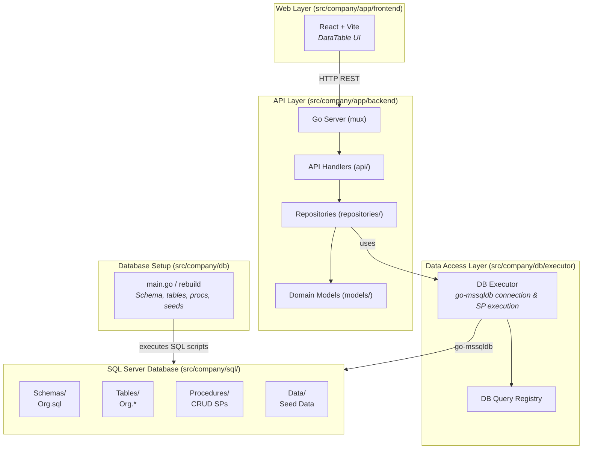
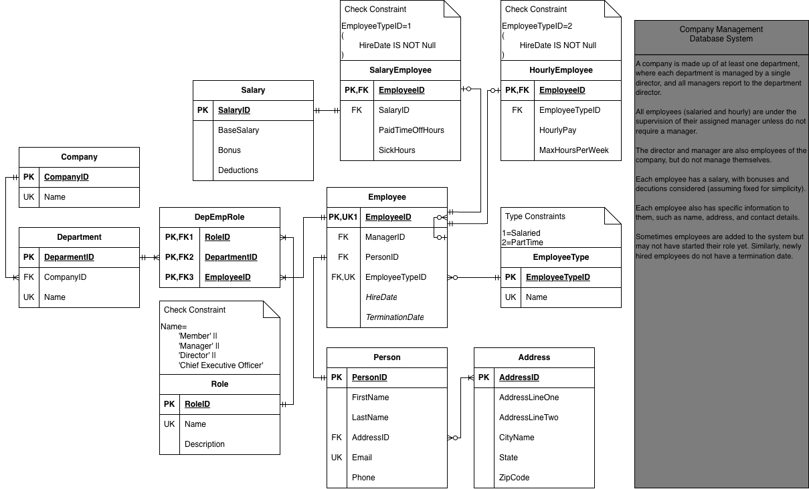

[](https://classroom.github.com/open-in-codespaces?assignment_repo_id=23546253)
# Company Management Database System
This project comes with a two-part development container:
- A Microsoft SQL Server Express server. This comes setup with two databases. [WideWorldImporters](https://github.com/Microsoft/sql-server-samples/tree/master/samples/databases/wide-world-importers) and **CC520**, which is a blank database. How to use these is outlined below.
- A Ubuntu server, which is where you run the Golang backend API and ReactJS frontend web app.

**Note:** This dev container can take anywhere between 3-5 minutes to setup from scratch. Once the servers are created, VS Code will install extensions. Once the MSSQL extension is installed (you will see a server icon show up on the left hand side), you can continue to the next section.

## Project Summary

The project involves building a company management database system that is targeted towards enterprise HR management companies. Its purpose is to streamline the management of company employees, such as onboarding/terminating employees, moving employees to different departments, reassign employees to other managers, adjust their pay structure, and other functions.

> [!IMPORTANT]
> This README was adapted from the course database project, summarization was provided by Gemini.

## Connecting to the Database

Open the MSSQL extension (server icon on the left). If it is your first time opening it, it will do some initial configurations. Three databases are included as part of this setup:
1. **CC520**: `USE CC520;`. This database is where the `Org` schema is stored for this project.
2. **wide-world-importers**: Included in case you want to experiment with a larger database. 
3. **ms-sql-server-admin**: This database is purely for the management of the MS SQL Server instance for this development environment. You should not have to use this for anything in this class, but it is here if you would like to explore.

  **Example database connection information:** 
  - **Profile Name**: `Any Name` (if specifying the database, see option below, it is helpful to name it after the database you are connecting to)
  - **Input Type**: `Parameters`
  - **Server Name**: `localhost`
  - **Trust server certificate**: Check this box
  - **Authentication type**: `SQL Login`
  - **User name**: `cc520-admin`
  - **Password**: `database3ssentials!`
    - NOTE: If the cc520-admin user should give you access to both databases listed above...but if you need higher admin access, use the credentials below:
      - **User name**: `SA`
      - **Password**: `sup3rs3cur3P@ssword`
  - **Save password**: Check this box 
  - **Database name**: This is optional. If you do not specify a database name, when you run a query, you will need to specify the database then (`USE databasename`). If you do specify the database name here, then you will need to add a new connection for each database you need to use.

## Project Layout

```text
├── scripts/                    # Utility scripts
│   ├── rebuild_db.sh           # Script to run database rebuild
│   └── run_app.sh              # Script to run both backend and frontend servers
├── src/                        # Application source code
│   └── company/                # Main application directory
│       ├── app/                # Application layer
│       │   ├── backend/        # Golang Backend API (mux, sqlserver)
│       │   │   ├── api/        # HTTP Handlers
│       │   │   ├── models/     # Domain models
│       │   │   ├── repositories/ # Data access layer
│       │   │   └── server/     # Entry point (main.go)
│       │   └── frontend/       # ReactJS Frontend (Vite)
│       │       └── src/        # React components (DataTables, etc.)
│       ├── db/                 # Database setup and migration in Golang
│       │   ├── executor/       # DB executor and query registry
│       │   ├── rebuild/        # Rebuilds schema, tables, procedures, and seed data
│       │   └── main.go         # DB Rebuild script entry point
│       └── sql/                # SQL scripts used by the rebuild process
│           ├── Data/           # Seed data (MERGE-based upserts)
│           ├── Procedures/     # Stored procedures
│           ├── Schemas/        # Schema creation (Org)
│           └── Tables/         # Table definitions
```

### Architecture Diagram

The below diagram can be viewed in VS Code via the mermaid plugin, on the Github repo page, or you can open the project-diagram.svg (located in this project's root folder) in your local web browser.



## Database Design

The following ERD was used for building the database:



## Getting Started

Follow these steps to set up and run the full stack application.

### 1. Create a `.env` file

Create a `.env` file in the project root with your database connection information. You can copy the provided `.env.example` file:

```
SQL_SERVER_CONNECTION_STRING=Data Source=localhost,1433;Initial Catalog=CC520;User ID=cc520-admin;Password=database3ssentials!;Pooling=False;Connect Timeout=15;Trust Server Certificate=True;Authentication=SqlPassword
```

### 2. Install Frontend Dependencies

Navigate to the frontend directory and install the necessary npm packages:

```bash
cd src/company/app/frontend
npm install
cd ../../../..
```

### 3. Rebuild the Database

The project includes a Go-based database rebuild tool wrapped in a shell script. This will set up your database schema, tables, stored procedures, and initial seed data:

```bash
# full schema + tables + procedures + seed data
./scripts/rebuild_db.sh rebuild
```

Other available database operations:
- `./scripts/rebuild_db.sh clear` — Drop all tables and schemas
- `./scripts/rebuild_db.sh seed` — Re-seed data with sample data

### 4. Run the Application Servers

Start both the Go Backend API and the React Frontend development servers concurrently by going to the debugger and run `Fullstack` in the dropdown.
You can also run each of these in separate terminals to achieve the same:

- `go run src/company/app/backend/server/main.go`
  - **Backend API:** Runs on `http://localhost:8080`
- `cd src/company/app/frontend && npm run dev`
  - **Frontend App:** Typically runs on `http://localhost:5173` (check terminal output from Vite)

Navigate to the Frontend App URL in your web browser to interact with the Company Management Database System.

## OpenCode Setup

### Automated Setup

Run `./scripts/setup_opencode.sh`, and in the `auth.json` you can add api keys to your preferred models. The `opencode.json` file
allows for local models to be used instead.

### Manual Setup

For a manual setup, you need to have OpenCode installed on your host machine. If it is installed,
then you need to have a symlink that points your auth.json to the project root `.opencode` folder.
To generate the `auth.json` file, run `opencode auth login` and register a provider with an API key.

```sh
# In project root:
mkdir .opencode
cd .opencode && ln ~/.local/share/opencode/auth.json
```

See this [blog](https://danz.blog/blog/opencode-in-devcontainers) for more details.

If you want to use a local model, add an `opencode.json` file into `.opencode/`:

```json
{
  "$schema": "https://opencode.ai/config.json",
  "permission": {
    "edit": "ask",
    "bash": "ask",
    "webfetch": "allow"
  },  
  "provider": {
    "lmstudio": {
      "name": "LM Studio (local)",
      "npm": "@ai-sdk/openai-compatible",
      "options": {
        "baseURL": "http://host.docker.internal:1234/v1"
      },
      "models": {
        "openai/gpt-oss-20b": {
          "name": "gpt-oss-20b",
          "thinking": true
        }
      }
    }
  }
} 
```


## Disclaimer on Security

This application does not include any management of database user roles or user permissions through the web application. In a real-world setting, these would be included. Security was not considered for this example to simplify the implementation to showcase how to run queries and retrieve results from a database.
